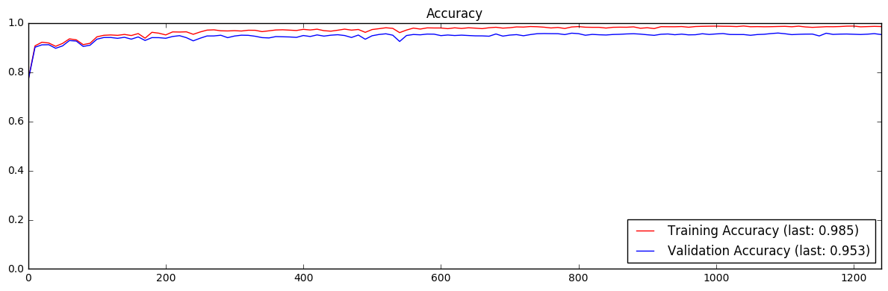

# Pipeline for Vehicle Identification and Localization (PipeVIaL)

The Pipeline for Vehicle Identification and Localization (PipeVIaL) implements a solution to Project 5 of Udacity's Self-Driving Car Engineer nanodegree – namely, detection and tracking of vehicles in a video recorded from a front-mounted camera on a car traveling down a road. It works by performing the following operations on video image frames:

1. Compute a Histogram of Oriented Gradients (HOG) from an input image;
2. Use a trained classifier to determine the likelihood that extracted image patches (64x64 sections represented as HOG blocks) depict a vehicle;
3. Use the classification result to update a running estimate of the number and position of vehicles in the video;
4. Use the running estimates to draw square labels marking the detected vehicles.

The following sections discuss the implementation of the above process, experiments performed, results achieved and perspectives for further improvement.

## Implementation

PipeVIaL was implemented as an [IPython](https://ipython.org/) [notebook](P5.ipynb) relying on a variety of libraries for advanced operations. Specifically, [numpy](http://www.numpy.org/) is used for multidimensional types (arrays, matrices, images) and general data manipulation; [OpenCV](http://www.opencv.org/) for more advanced image processing routines; [scipy](http://scipy.org/) and [scikit-learn](http://scikit-learn.org) for statistics and machine learning; [matplotlib](http://matplotlib.org) for visualization; and [moviepy](http://zulko.github.io/moviepy/) for video file input/output.

PipeVIaL makes extensive use of Python classes to model the variety of concepts and data involved in the process of lane detection. A recurrent motif is the use of _callable objects_ to encapsulate a function with parameters that can be calculated once and then reused over the system's life-cycle, or otherwise keep state that is used between calls. This can be seen for example in the `Identifier` class, which encapsulates a trained classifier and image search parameters, using them to process input images and return likelihood maps of vehicle presence.

The algorithms implemented on PipeVIaL often require a couple manually adjusted parameters to be provided. Those add up fast, and can become hard to manage. Therefore, a global `params` object is used to hold together all such settings in a single place. Global data generally isn't a good idea, but here it's forgivable since it's no more than an alternative way to specify what would otherwise be defined as a set of constants. The following subsections give further details on those algorithms and their implementation.

### Histogram of Oriented Gradients (HOG) Computation

In order to make patch identification effective, features that encode relevant visual information for telling apart vehicle and non-vehicle patches must be computed. The [Histogram of Oriented Gradients (HOG)](https://en.wikipedia.org/wiki/Histogram_of_oriented_gradients) is a feature descriptor useful for object identification tasks. The [scikit-image](http://scikit-image.org/) library provides an [implementation](http://scikit-image.org/docs/dev/api/skimage.feature.html#skimage.feature.hog) with several conveniences such as generation of visualization images. PipeVIaL implements a shortcut to this function with some preset parameters and additional conveniences, such as automatic conversion of color images to grayscale; see section 3 of the [notebook](P5.ipynb).

Three parameters are required by scikit-image's `hog()` function: the number of distinct gradient orientations to recognize, the dimensions of the aggregated gradient cell, and the dimensions of the cell-normalizing block. PipeVIaL's `HOG()` convenience function computes the size of the block so it coincides with the dimensions of the search window used to extract image patches; the advantages of this coincidence will become clear when we discuss image searching. At any rate, this still leaves the number of orientations and the size of cells as free parameters.

The images below depict the effect of extracting HOG features from some images at different values for both parameters. Vehicle and non-vehicle samples are alternately displayed along with their HOG's to also illustrate the differences between the two classes.

---

`orientations =   4, cell side =  2`

---

`orientations =   9, cell side =  3`

---

`orientations =  16, cell side =  4`

---

`orientations =  25, cell side =  5`

---

`orientations =  36, cell side =  6`

---

`orientations =  49, cell side =  7`

---

`orientations =  64, cell side =  8`

---

`orientations =  81, cell side =  9`

---

`orientations = 100, cell side = 10`

---

`orientations = 121, cell side = 11`

---

`orientations = 144, cell side = 12`

---

`orientations = 169, cell side = 13`

---

`orientations = 196, cell side = 14`

---

`orientations = 225, cell side = 15`

---

`orientations = 256, cell side = 16`

---

Looking into the pictures above, it becomes clear that as parameter values increase, HOG features become more generalized. This however is a double-edged blade: more general HOG's mean that cases from the same classes become more alike, but it also means that edge cases across both classes tend to become harder to tell apart. Performance factors also come into play when the code that produced the images above is actually run: larger cell sizes make the features more compact and faster to compute, even with increased orientation counts. Taken together, these considerations led to the choice of a cell side of `8` pixels and `64` distinct orientations as the best trade-off between generality / distinctiveness and performance.

### Classifier Training

THe HOG's from vehicle and non-vehicle images are used to train a classifier for the two classes. In order to keep memory requirements down, a [SGDClassifier](http://scikit-learn.org/stable/modules/generated/sklearn.linear_model.SGDClassifier.html) (which performs stochastic gradient descent on a Support Vector Machine) was trained using mini-batches extracted from the training dataset. See section 4 of the [notebook](P5.ipynb) for the implementation. The figures below show classifier accuracy over several training epochs:

---

**Epoch 1**

---

**Epoch 2**

---

**Epoch 3**

---

**Epoch 4**

---

**Epoch 5**

---

As the figures above show, the classifier quickly achieves a classification accuracy over 92% against the validation dataset, but from that point on each extra percent accuracy is hard won over many training iterations. Some hyperparameter tuning was also used to squeeze out a few more drops of accuracy, with the `alpha` parameter that controls the evolution of the learning rate increased to a better performing value. As will become clear later on, this effort is not frivolous – even this seemingly high accuracy rate still lets through a troubling amount of false positives.

### Image Search

Conventionally, in order to use the classifier trained above to identify vehicles across a larger input image, a sliding window of the same size as the training cases would be used to extract image sections, have their HOG features individually extracted then submitted to the classifier. However, since we set the HOG's block size parameter to cover all cells inside a window, a much simpler alternative becomes available: extract HOG features for the whole HOG image at once, then take each block (which in the multidimensional representation can be done trivially, by indexing the first two dimensions of the HOG array) as an input feature vector to the classifier. This approach has the added advantage of making the HOG's cell size parameter also work as the step parameter for the (now all but abstracted away) sliding window. See section 5 of the [notebook](P5.ipynb) for the implementation.

The figures below show the results of applying the technique outlined above to some video frame samples. Left column shows the original frames, and right column, annotated ones. Green shades over the images indicate a likelihood that a vehicle is found in that region, with brighter shades indicating higher likelihood.

---

---

As the figures above show, image search works well even when cars look much larger than the 64x64 window used for training. This is explored in the next part of the implementation, where likelihood values are aggregated into square labels.

### Vehicle Labeling

Likelihood values as those computed above must next be aggregated into square vehicle labels. This is done over the following steps:

1. A threshold is applied to likelihood maps to ignore weak identifications;
2. Adjacent positive identifications are combined into single values, located at the cluster's centroid;
3. Square labels are placed around each centroid, their sides scaled according to the centroid position (e.g. labels closer to the image bottom are larger, as they are expected to be assigned to nearer vehicles);
4. Labels that intersect are further merged;
6. Each label is assigned a detection count, that is decreased for every new frame processed, and increased when newly detected centroids lay inside their borders;
6. Any labels past a given detection count are displayed;
7. Any labels with a detection count of zero are removed.

See section 6 of the [notebook](P5.ipynb) for the implementation. The figures below show the results of applying the technique outlined above to some video frame samples. Left column shows the original frames, and right column, annotated ones.

---

---

As the figures above show, the labeling subsystem is not above false positives (especially when no vehicles are visible) or false negatives (when two vehicles are close by), but overall it correctly identifies the presence and location of vehicles, consistently following them across frames.

## Experiments

Video file [project_video.mp4](data/project_video.mp4) was used as the project evaluation target. An annotated video file [project_video_annotated.mp4](data/project_video_annotated.mp4) was computed with square labels added to the locations estimated to contain vehicles, as explained above. See section 7 of the [notebook](P5.ipynb) for a handy in-browser visualization interface.

Results were generally correct, though some false positives are visible (most glaringly one right in front of the field of view for the first 10 seconds or so). Labels tend to jiggle around vehicles, especially close to the transition limits between side lengths. Also as noticed above, when cars get close to each other labels are sometimes incorrectly merged.

## Conclusions

The Pipeline for Vehicle Identification and Localization (PipeVIaL) is a system for vehicle identification and tracking, using a video recorded from a vehicle's front-mounted camera as input. Experiments show it can work reasonably well in fairly realistic (albeit specific) conditions, though it is still troubled by both false positives and false negatives. Improvements to vehicle identification should therefore take priority in further development. More elaborate methods to tell apart multiple vehicles, and ways to make labels move more smoothly across frames, should also be considered.
